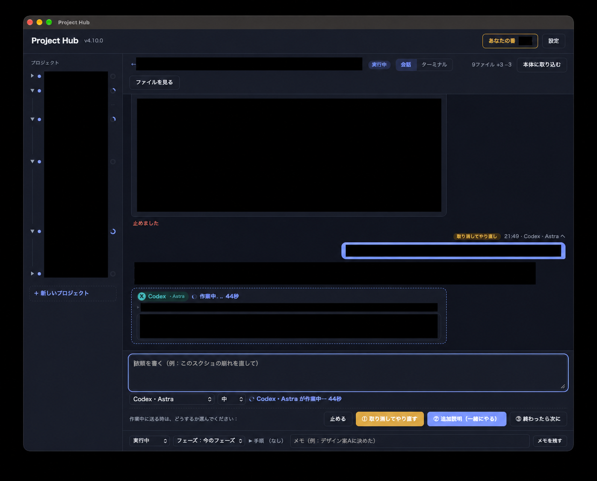
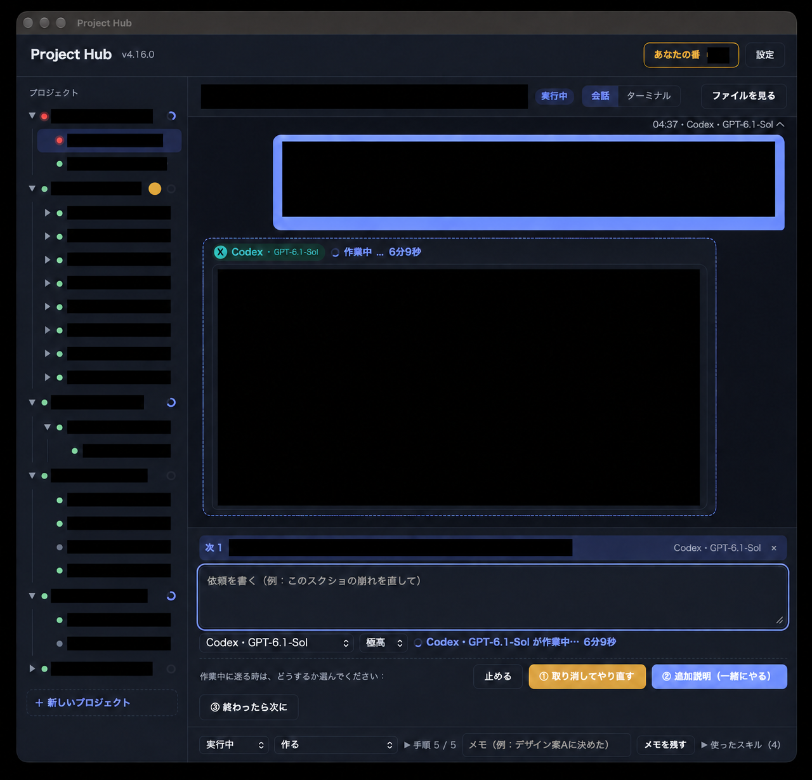

# Project Hub

プロジェクトと作業を一覧にして、画面の中で Claude Code / Codex を動かす管理ソフトです。1人で使う Mac の中だけで使います。待ち受けるのは `127.0.0.1` だけで、利用者の認証はありません。Web サービスや共有サーバーとしては使えません。

使う前に、[hub/README.md](hub/README.md) の「使う前に知っておくこと」を読んでください。

## 画面の例

以下は過去の版で撮影した実際の画面です。個人情報・事業内容・実際の会話は黒塗りしています。撮影時点の版のため、現行版（4.20.0）の画面とは異なる場合があります。

### 会話画面と作業中の指示（取り消し／追加説明／次の指示）

2026-09-29 撮影、v4.10.0 時点の画面（黒塗り加工済み）



### 会話画面と次の指示が並ぶ画面

2026-09-30 撮影、v4.16.0 時点の画面（黒塗り加工済み）



## 前提

- macOS
- Node.js 22 以上、Git
- 使う AI の CLI（Claude Code / Codex）を入れて、ログインしておく
- 作業画面の部品（node-pty）とアプリ（Project Hub.app）を作るには、Apple の開発ツールが必要

## はじめる

取得したフォルダの一番上（この README がある所）で、次を実行します。

```
bash hub/setup.sh
```

- `~/Documents/AI-Workspace/` に `_hub/`・`Product/`・`Work/` を作ります。場所は `HUB_ROOT` で変えられます
- 何度実行しても大丈夫です。すでにある `roles.yaml` と台帳（`PROJECT.md` があるフォルダ）は触りません
- npm で node-pty を入れ、デスクトップに Project Hub.app を作ります

使い方・更新のしかたは [hub/README.md](hub/README.md) を見てください。

## 注意

- **AI の許可確認**：既定では、Claude Code は許可確認を省き、Codex は許可確認とサンドボックスを省いて起動します。AI は利用者の権限でファイルを書き換えたり、コマンドを動かしたりできます。変える時は `_hub/roles.yaml` の `permissions` で指定します
- **料金**：AI の料金・プラン・課金のしかたは、各 CLI 側の設定に従います。Project Hub は料金がかからないことを保証しません
- 自動の Git 保存、作業用コピーに写す設定ファイル、手元に残る記録などの注意は [hub/README.md](hub/README.md) にあります

## テスト

```
HUB_SKIP_NPM=1 npm --prefix hub test
```

node-pty が入っていない時は、作業画面を実際に動かす確認は省きます。

## 同梱の初期台帳（seed）

`hub/seed/` には、架空の「サンプルアプリ」「サンプルサイト」「サンプル文書」「Project Hub」の台帳が入っています。実際のプロジェクトや作業の記録ではありません。`setup.sh` はこれらを `Product/<名前>/` に写します。

## この公開物について

このフォルダは、Project Hub の部分だけを Git の履歴なしで切り出したものです。元の作業コピーで `node scripts/export-public.js` を実行すると `public-release/ProjectHub` に作り直せます。

- 実際の作業の記録（`.ai/` の会話・引き継ぎなど）は入っていません。ひな形と架空の台帳に必要な `.ai/` のファイルだけを入れています
- 公開版の [CHANGELOG](hub/CHANGELOG.md) は 4.20.0 から始まります（それより前の記録は過去の資料を含むため外しています）

## 参考にしたもの

考え方を参考にしました。どちらもソースは同梱しておらず、依存もしていません。

- teddashh/bat-agent-connector（MIT）：入力待ちの見張り、取り込み前の確認、操作の記録
- arumwu/goose-acp-handoff：AI を交代する時の引き継ぎ資料

## ライセンス

Project Hub は MIT ライセンスです（Copyright (c) 2026 kieiken）。全文は [LICENSE](LICENSE) にあります。

このソフトは、もとは Discord Bot テンプレート「discordpy-startup」（MIT、Copyright (c) 2019-2020 Discord Bot Portal JP）のリポジトリで作り始めました。テンプレートの Bot・Python・Heroku の設定はこの公開物には入っていませんが、由来としてその著作権表示と許諾文を残しています。

同梱の xterm.js や、npm で入る node-pty など第三者のソフトについては [THIRD_PARTY_NOTICES.md](THIRD_PARTY_NOTICES.md) を見てください。
